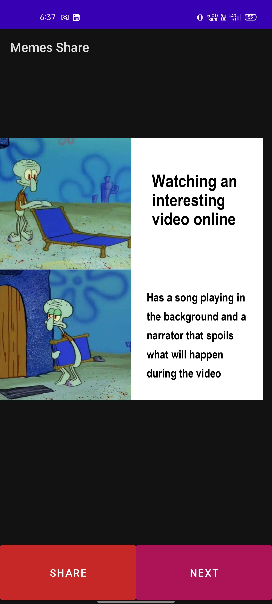
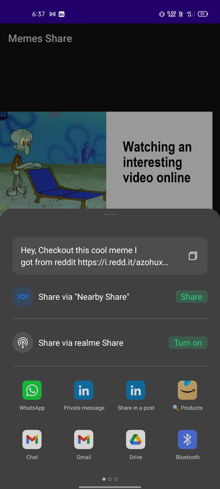

# Memes Share App (Kotlin)

The Memes Share App is an Android application developed in Kotlin. It allows users to view and share memes sourced from the Reddit API. The app displays one meme at a time, and users can navigate through the collection by clicking on the "Next" button.

## Features

- Fetches memes data from the Reddit API using JSON object requests.
- Displays memes one at a time.
- Provides a "Next" button to navigate to the next meme.
- Allows users to share memes with others through the Android sharing options.

## Screenshots

## Usage

To use the Memes Share App, follow these steps:

1. Clone this repository to your local machine.

2. Open the project in Android Studio.

3. Build and run the app on your Android device or emulator.

4. Upon launching the app, a meme will be displayed.

5. Click on the "Next" button to view the next meme in the collection.

6. To share a meme, click on the share button and select your desired sharing option from the Android sharing menu.

## Implementation Details

The Memes Share App utilizes the following:

- Kotlin programming language
- Android SDK
- JSON object requests to fetch memes data from the Reddit API
- Picasso library for image loading and caching

